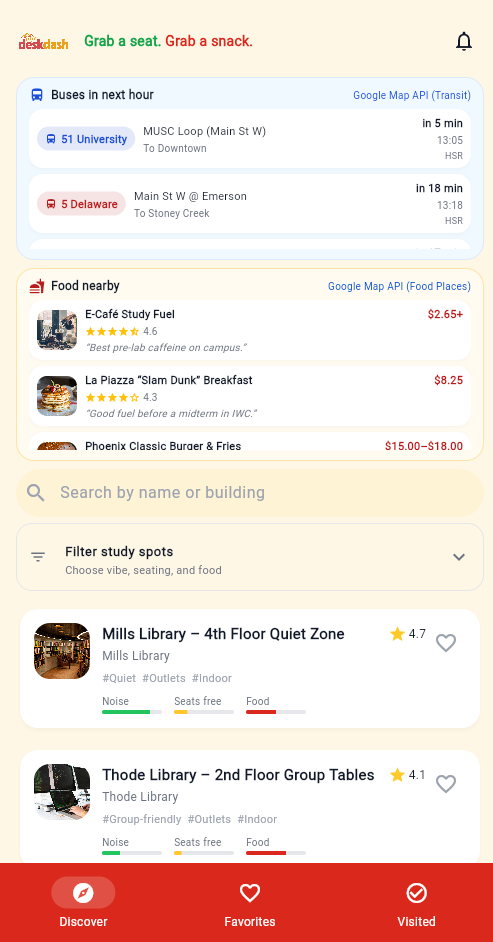
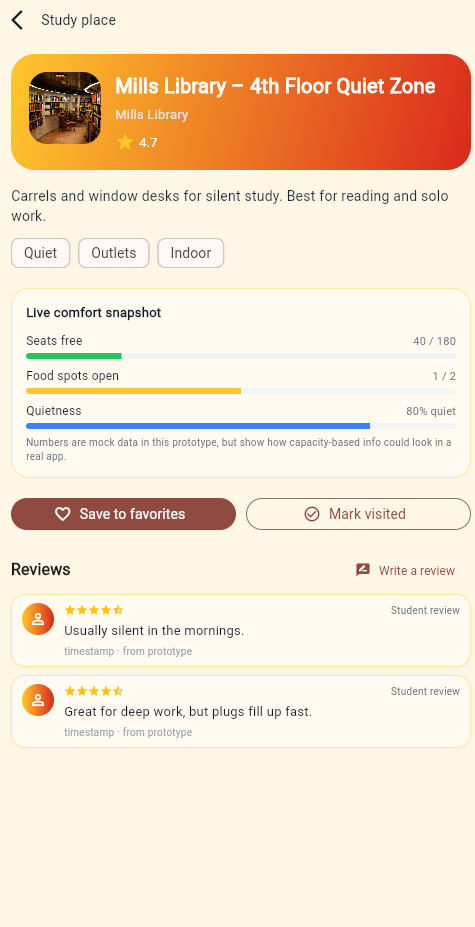

# DeskDash – McMaster Study Spot Finder


DeskDash is a mobile-first Flutter app that helps McMaster students quickly find a place to study on campus.

The app focuses on real student decisions:

> “Do I have a seat nearby, is it quiet enough, is there food close, and when is my next bus?”

---

Home screen – study cards + food + buses:



Place details – comfort snapshot + reviews:



---

How to run:
- (Recommand) Download APK for folder:
    ```bash
  apks\app-debug.apk

or:
- From the project root, install dependencies:

  ```bash
  flutter pub get

- Run instantly in Chrome (recommended – no phone/emulator needed)"
  ```bash
  flutter run -d chrome

- (Optional) Build a debug APK for Android:
    ```bash
  flutter build apk --debug